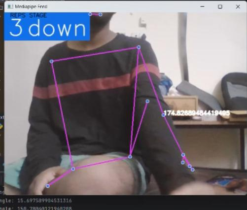

# Pose Detection and Angle Calculation using OpenCV and Mediapipe

This Python script utilizes OpenCV and Mediapipe to perform real-time pose detection and angle calculation from a webcam feed. It demonstrates how to track specific body landmarks and calculate angles between joints, suitable for fitness monitoring applications.

## Requirements

- Python 3.x
- OpenCV (`opencv-python`)
- Mediapipe (`mediapipe`)
- NumPy (`numpy`)

Install dependencies using pip:
```bash
pip install opencv-python mediapipe numpy
```

## Usage

1. **Run the Script**:
   - Ensure your webcam is connected and accessible.
   - Execute the script `exerciserepetitioncounter.py`.

   ```bash
   python exerciserepetitioncounter.py
   ```

2. **Functionality**:
   - The script captures video from the default webcam (index 0).
   - It detects poses using the Mediapipe library and calculates angles between specified joints (shoulder, elbow, wrist).
   - Repetition counting logic identifies movements based on angle thresholds (`> 160` and `< 30` degrees).
   - Visual feedback includes displaying angles, repetition counts (`REPS`), and current stage (`STAGE`) on the video feed.

3. **Controls**:
   - Press `q` to exit the application.

## Example Output

- Angle: 174.8
- Counter: 3
- Stage: down

## Example Output



